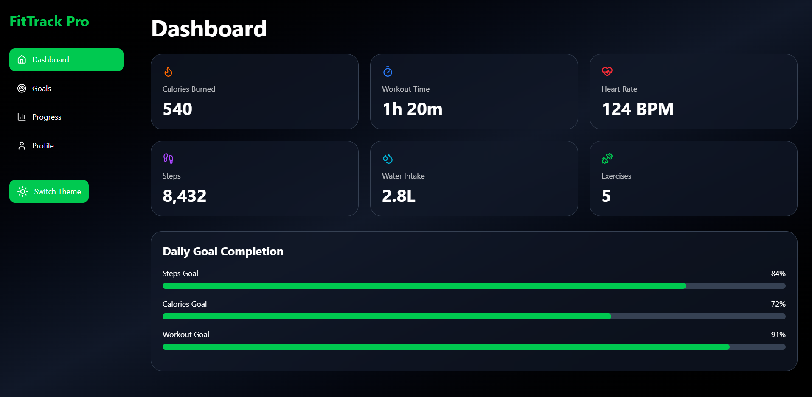
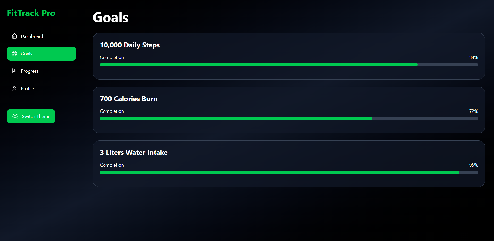

# 🏋️ Fitness Tracker AI

A modern and interactive fitness tracking dashboard built using React, Vite, Tailwind CSS, Framer Motion, and Recharts.

Track daily fitness goals, monitor health metrics, visualize workout progress, and manage your fitness journey through a clean and responsive user interface.

---

## ✨ Features

- 📊 Interactive Fitness Dashboard
- 🎯 Goal Tracking System
- 📈 Progress Analytics
- 👤 User Profile Section
- 🌙 Dark / Light Theme Toggle
- ⚡ Smooth Animations with Framer Motion
- 📱 Fully Responsive Design
- 🔥 Modern Glassmorphism UI
- 💪 Workout & Health Metrics Monitoring

---

## 📸 Preview

Add screenshots of your application here.

### Dashboard


### Goals Section


### Profile Section


---

## 🛠️ Tech Stack

| Technology | Purpose |
|------------|----------|
| React | Frontend Development |
| Vite | Fast Build Tool |
| Tailwind CSS | Styling |
| Framer Motion | Animations |
| Recharts | Data Visualization |
| Lucide React | Modern Icons |

---

## 🚀 Installation

Clone the repository:

```bash
git clone https://github.com/sakshamm2/fitness-tracker-ai.git
```

Navigate to project folder:

```bash
cd fitness-tracker-ai
```

Install dependencies:

```bash
npm install
```

Run development server:

```bash
npm run dev
```

Build for production:

```bash
npm run build
```

---

## 📂 Project Structure

```text
fitness-tracker-ai/
│
├── public/
├── src/
│   ├── App.jsx
│   ├── FitnessTrackerWebsite.jsx
│   ├── main.jsx
│   └── assets/
│
├── package.json
├── vite.config.js
└── README.md
```

---

## 🎯 Future Improvements

- User Authentication
- Workout Planner
- AI Fitness Recommendations
- BMI Calculator
- Calorie Prediction System
- Database Integration
- Cloud Deployment

---

## 👨‍💻 Author

**Saksham Yadav**

GitHub: https://github.com/sakshamm2

---
🚀 Live Demo

https://fitness-tracker-ai-six.vercel.app

## 📄 License

This project is open-source and available under the MIT License.
